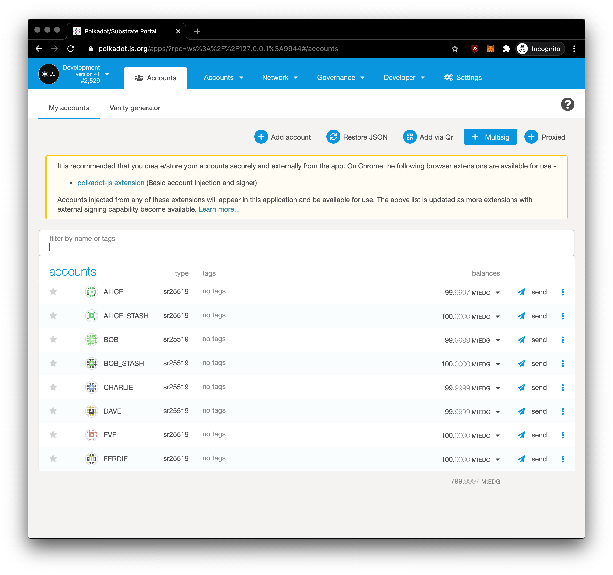
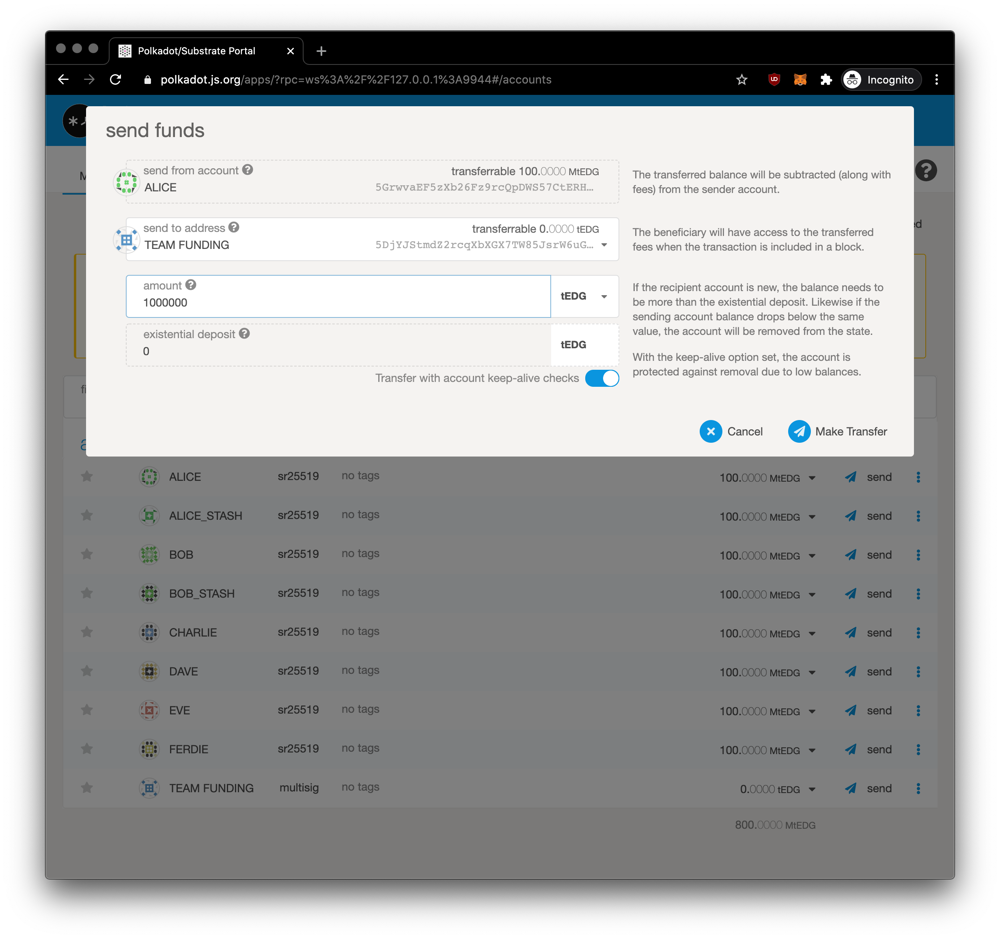
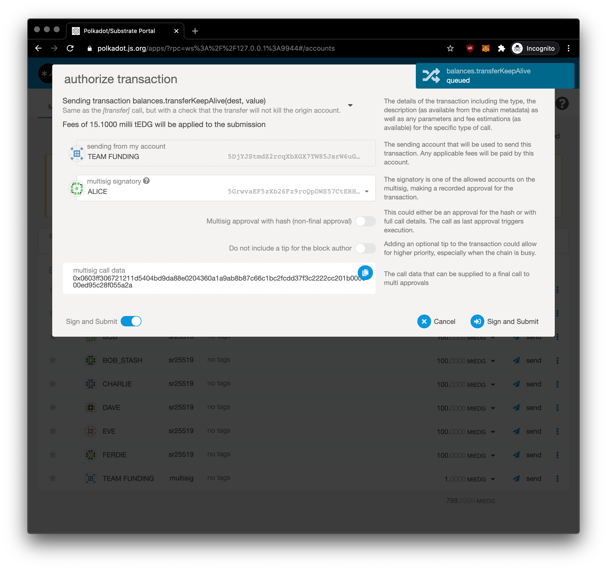
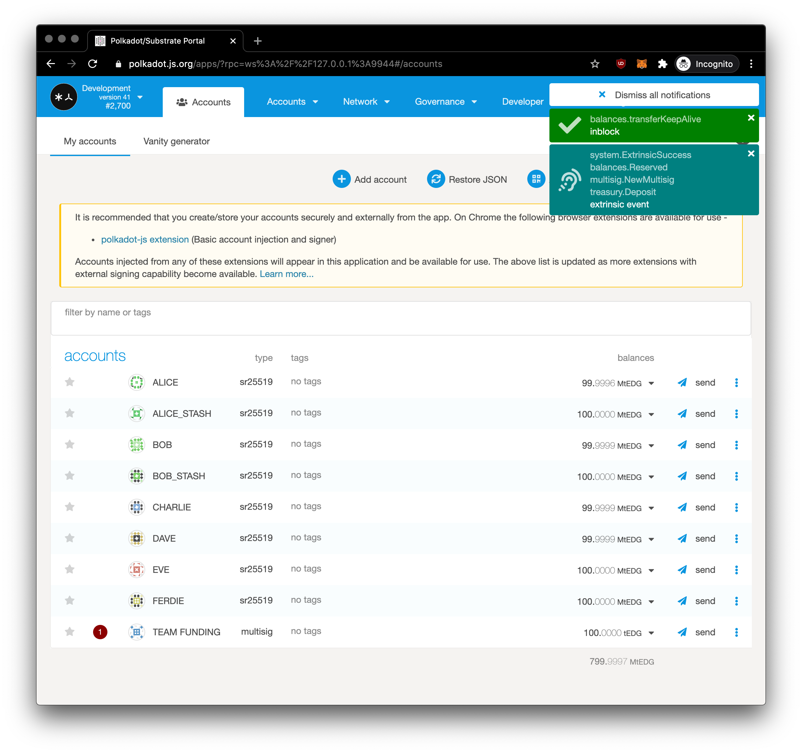
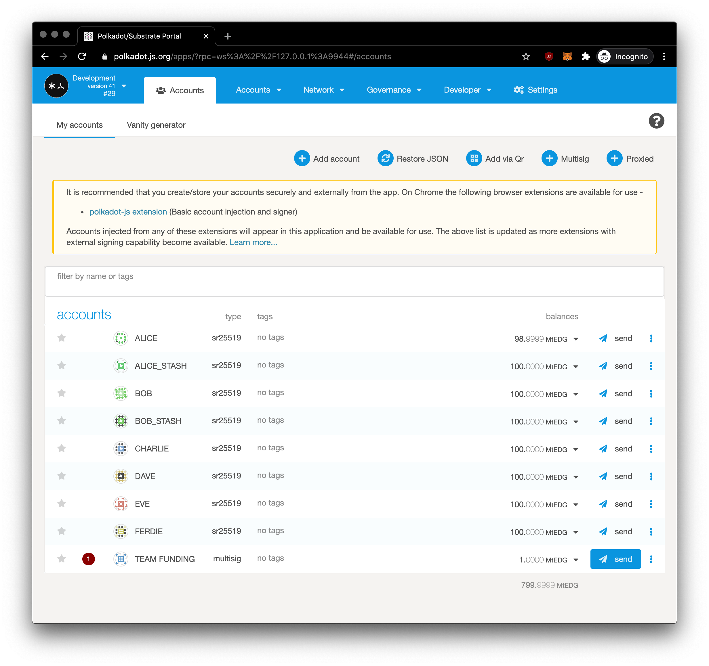
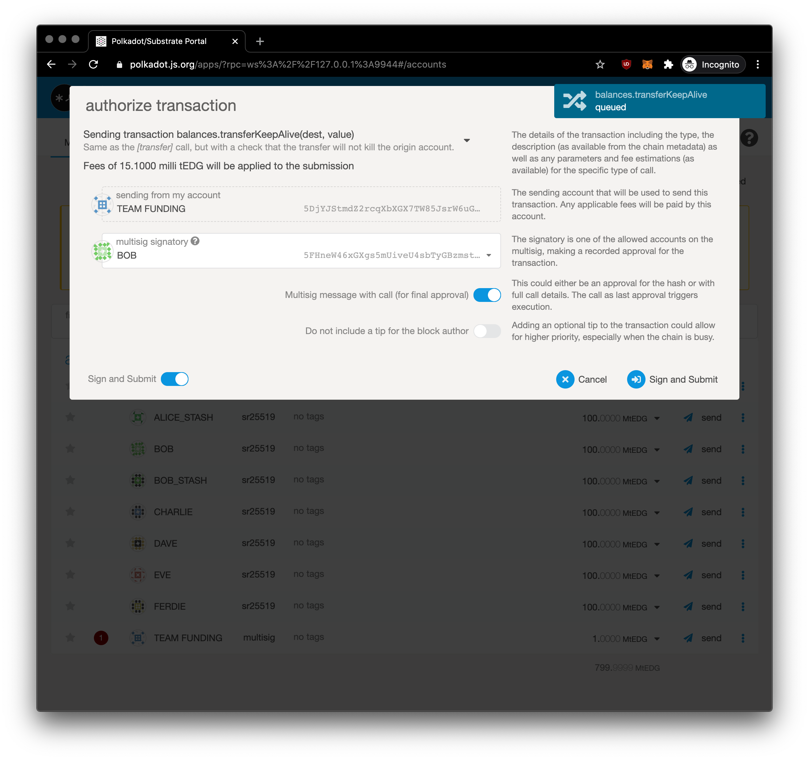
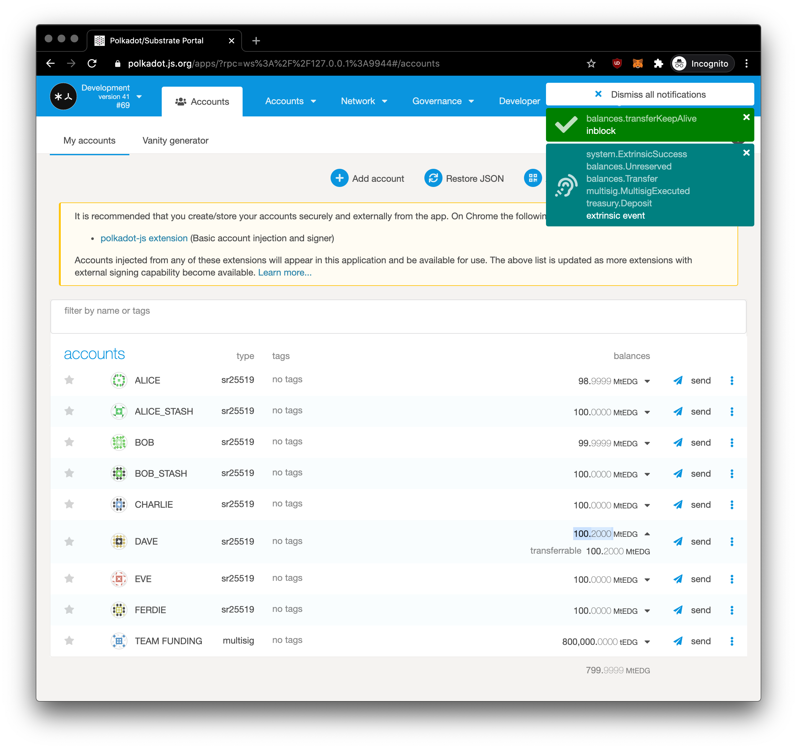

+++
title = "Создание учетной записи с мультиподписью"
sort_by = "weight"
updated = 2022-10-02T15:00:00Z
+++

В этой главе мы создадим учетную запись с мультиподписью и выполним тестовую транзакцию из этой учетной записи.

Вы перейдете в [Учетные записи в приложениях](https://polkadot.js.org/apps/#/accounts)

Вы выберете свои подписи, то есть учетные записи ваших товарищей по команде, в нашем сценарии мы выбираем **Алису, Боба и Чарли**. Мы устанавливаем **порог равным 2**, это означает, что нужна только подпись от **двух из трех**. Вы можете установить пороговое значение, меньшее или равное количеству подписантов для мультиподписи. Мы называем это нашим счетом **Team Funding**.

Теперь мы пополним **1 000 000** tEDG на мультиподписной счет **Team Funding** от **Alice**. Спасибо, Алиса!

## Создание перевода из учетной записи с мультиподписью

Теперь, когда счет **Team Funding** пополнен, мы можем заплатить **DAVE** **200 000** tEDG для завершения проекта. В списке наших аккаунтов нажмите **Отправить** из нашего аккаунта **Team Funding**.

Теперь нам предлагается \(**как ALICE**\) авторизовать транзакцию.

Вы увидите там `multisig call data` с полезной нагрузкой `0x0603ff306721211d5404bd9da88e0204360a1a9ab8b87c66c1bc2fcdd37f3c2222cc201b000000ed95c28f055a2a`, которые представляют собой данные звонка, которые могут быть предоставлены для окончательного звонка для множественных утверждений. Это то, что запускает логику цепочки для выполнения команд. Вы нажмете «Подписать и отправить».

Запрос был передан в сеть, вы можете увидеть уведомление в правом верхнем углу.

Теперь мы нажимаем на три точки справа рядом с нашей учетной записью **Team Funding**, так как ожидается одобрение мультиподписи \(_red dot_\) и выбираем **Отправить**

Вы, как другой подписант \(**BOB**\), вводите ту же сумму и пункт назначения, чтобы **получить ту же полезную нагрузку для последнего вызова**.

Теперь мы как **BOB** можем авторизовать транзакцию. Пользовательский интерфейс достаточно умен и обнаружил его окончательное одобрение. Под переключателем _Multisig message_ вы увидите ту же полезную нагрузку, что и при создании мультиподписной транзакции. Нажмите «Подписать» и «Отправить», и он должен быть подписан 2 из 3 подписантов, что достаточно для этого сценария, чтобы транзакция могла пройти к DAVE.

Вуала, у ДЕЙВА есть деньги, **средства защищены** на его счету.

Вы научились проводить транзакцию с мультиподписью. Мультиподпись имеет широкий вариант использования, и вы можете использовать окончательный вызов для своего варианта использования, чтобы запускать то, что вы хотите в цепочке.
