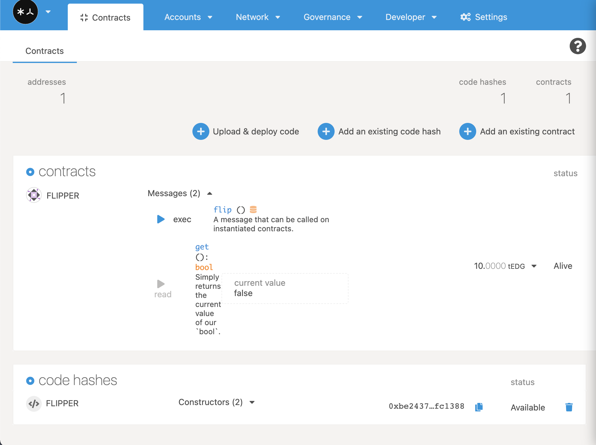
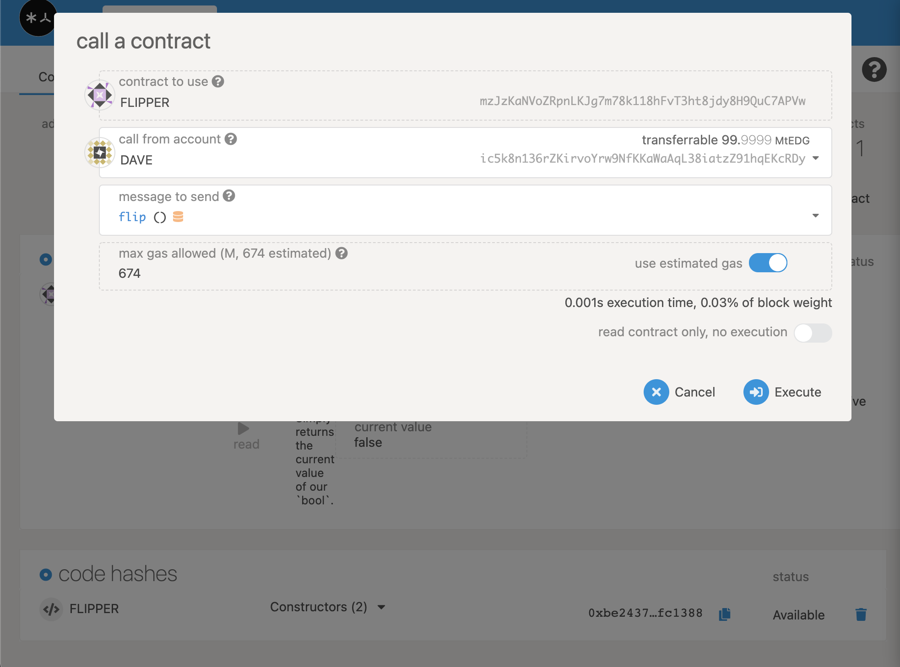
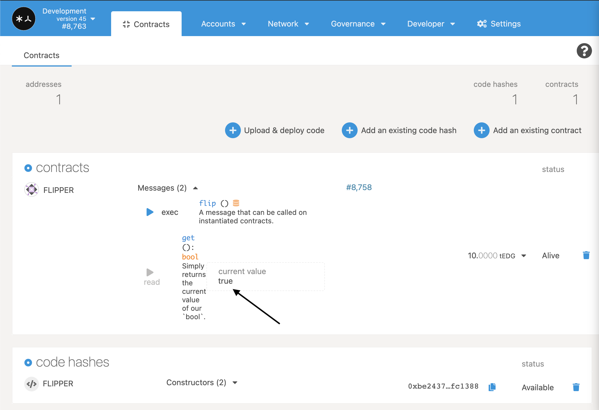

+++
title = "Вызов методов контракта"
sort_by = "weight"
updated = 2022-10-02T15:00:00Z
+++

Теперь, когда ваш контракт полностью развернут, мы можем начать с ним взаимодействовать! У Flipper есть только две функции, поэтому мы покажем вам, каково это — играть с ними обеими.

## get\(\)

Если вы вернетесь к функции `on_deploy()` нашего контракта, мы установим начальное значение контракта Flipper в `false`. Проверим, так ли это.



## flip\(\)

Итак, давайте сделаем значение `true` прямо сейчас!

Альтернативное **message to send**, которое мы можем создать с помощью пользовательского интерфейса, — это `flip()`. В этой обновленной версии контракт автоматически оценивает необходимое **максимально допустимое количество газа**. В данном случае это **674**. Оставьте расчетный газ включенным и **выполните** контракт. На следующем экране авторизуйте транзакцию, нажав кнопку «Подписать и отправить».



Вы заметите, что этот вызов фактически отправляет транзакцию. Если транзакция прошла успешно, мы сможем вернуться к функции `get()` и увидеть наше обновленное хранилище:



Ваууу! Вы развернули свой первый смарт-контракт!

## Движение вперед

Мы не будем повторять эти шаги по настройке и развертыванию, но будем использовать их на протяжении всего руководства. Вы всегда можете вернуться к этой главе, если вам нужно вспомнить, как выполнять определенный процесс.

В остальной части руководства будет **шаблон кода**, который вы будете использовать для прохождения различных этапов разработки контракта. Каждый шаблон поставляется с полностью разработанным набором тестов, которые должны пройти, если вы правильно запрограммировали свой контракт. Прежде чем перейти к разделу, убедитесь, что вы запустили:

```
cargo +nightly test
```

и что все тесты выполняются успешно, без каких-либо предупреждений.

Вам не нужно развертывать свой контракт между каждым разделом, но если мы попросим вас развернуть ваш контракт, вам нужно будет выполнить те же шаги, которые вы сделали с контрактом Flipper.
