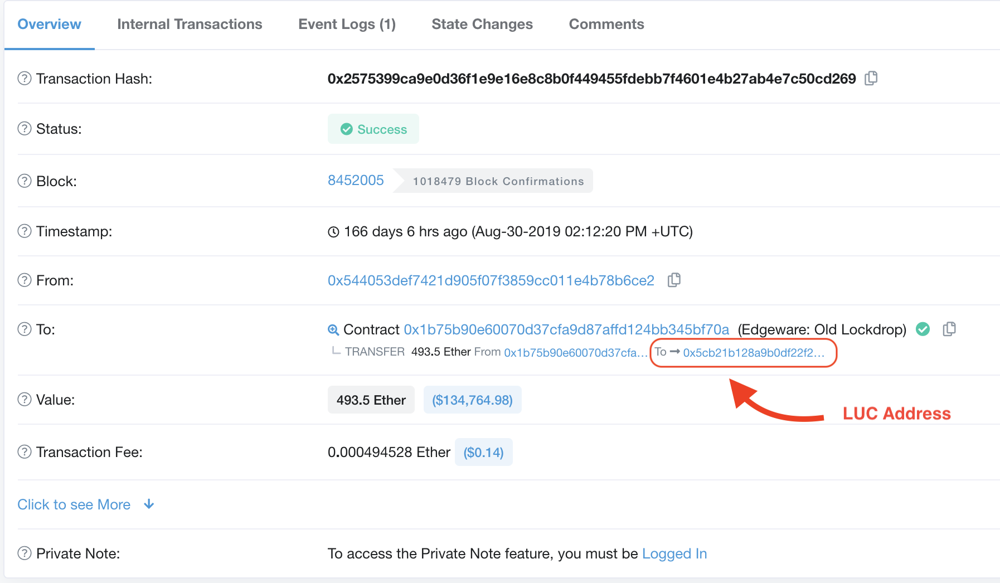

+++
title = "Найдите свой пользовательский контракт Lockdrop (LUC)"
sort_by = "weight"
updated = 2022-10-02T15:00:00Z
+++

---
description: Это краткое руководство по поиску адреса пользовательского контракта lockdrop.
---

Есть два способа узнать ваш адрес LUC, если вы его не сохранили:



Посетите обозреватель блоков, например [Etherscan.io](http://Etherscan.io) или другие.

Введите свой участвующий ETH-адрес и просмотрите список транзакций, чтобы найти одну или несколько транзакций, которые показывают назначение «Edgeware Lockdrop Contract». На нем также может быть написано «Старый» — это все еще действующий замок.

Ваш обозреватель блоков может не указывать название контракта. В этом случае транзакции по следующим адресам контрактов относятся к мастер-контрактам Lockdrop:

- `0x1b75B90e60070d37CfA9d87AFfD124bB345bf70a` \(V.1, Старый\)
- `0xFEC6F679e32D45E22736aD09dFdF6E3368704e31` \(v.2 New\)

Нажмите на идентификатор транзакции, чтобы увидеть конечный пункт назначения средств — MLC не удерживает ваш ETH, а сразу же отправляет его во вновь созданный LUC. Транзакция должна показать вам след от вашего адреса ETH -&gt; MLC - &gt; LUC.

Нажмите на свои адреса LUC, чтобы проверить баланс LUC и данные контракта.



Посетите страницу статистики блокировки на Commonwealth.im:
[https://commonwealth.im/edgeware/stats](https://commonwealth.im/edgeware/stats)

**Если эта страница недоступна или не работает, переключитесь на вкладку метода Block Explorer.**

Прокрутите вниз и введите свой ETH-адрес/а в нижнее поле.

Это покажет вам:

- Все экземпляры ваших LUC, сгенерированные с этого адреса
- Их время разблокировки
- И ETH заблокирован на LUC.
  
  


