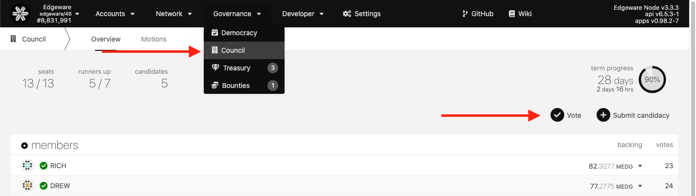
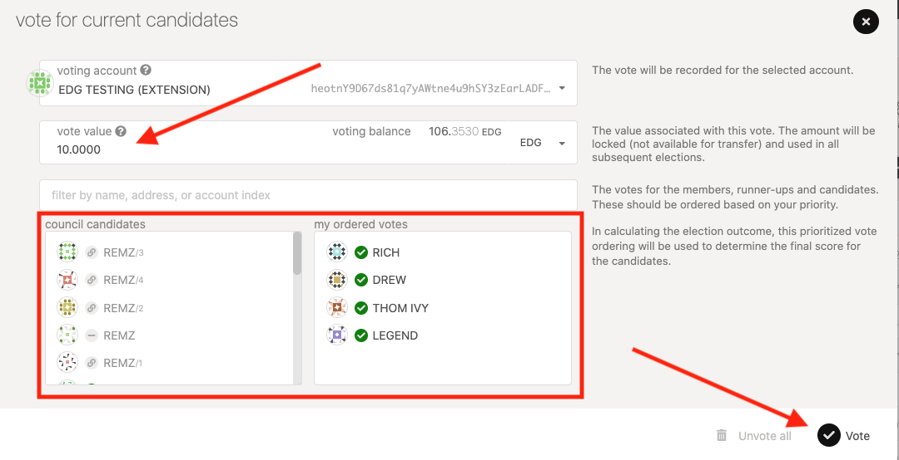
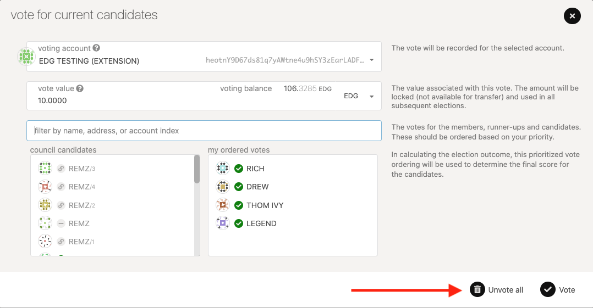

+++
title = "Голосование за Совет"
sort_by = "weight"
updated = 2022-10-02T15:00:00Z
+++

---
description: 'https://wiki.polkadot.network/docs/en/maintain-guides-how-to-vote-councillor'
---

## Вступление 

Совет — это выборный орган сетевых учетных записей, который предназначен для представления пассивных заинтересованных сторон Edgeware. У совета есть две основные задачи в управлении: предлагать референдумы и накладывать вето на опасные или злонамеренные референдумы. Это руководство проведет вас через процесс голосования за советников на выборах.

### Голосование за советников

Голосование за советников требует, чтобы вы заблокировали свой EDG на время вашего голосования. Как и при выборах валидатора, вы можете утвердить до 16 разных советников, и ваш голос будет уравнен среди выбранной группы. В отличие от выборов валидатора, для ваших зарезервированных токенов не существует периода развязки. Как только вы удалите свой голос, ваши токены снова станут ликвидными.

> Предупреждение: вы несете ответственность за то, чтобы не вкладывать весь свой баланс в зарезервированное значение, когда вы голосуете за советников. Лучше оставить хотя бы несколько EDG для оплаты транзакционных сборов.

Перейдите на [Панель инструментов Polkadot Apps](https://polkadot.js.org/apps), **подключитесь к конечной точке Edgeware** и щелкните вкладку «Совет». В правой части окна есть две синие кнопки, нажмите на ту, что с надписью «Проголосовать».

Поскольку совет использует голосование по одобрению, когда вы голосуете, вы сигнализируете, кого из валидаторов вы одобряете, и ваши проголосовавшие токены будут уравнены среди выбранных кандидатов. Выберите до 16 кандидатов в совет, переместив ползунок в положение «Да» для каждого кандидата, которого вы хотите избрать. Когда вы сделали правильную настройку, отправьте транзакцию.

#### Голосование за членов совета[¶]

1. Выберите, за кого вы хотите проголосовать, вы можете выбрать до 16
2. Введите значение вашего голоса, которое вы хотите использовать. затем нажмите голосование
3. Нажмите «Подписать и отправить» и подпишите транзакцию.

Вы должны увидеть свой голос в интерфейсе сразу после того, как ваша транзакция будет включена.

### Удаление вашего голоса

Чтобы вернуть зарезервированные токены, вам нужно будет удалить свой голос. Удаляйте свой голос только тогда, когда вы закончите участвовать в выборах и больше не хотите, чтобы ваши зарезервированные жетоны учитывались для одобренных вами советников. Вернитесь к голосованию и нажмите Отменить все.

Перейдите на вкладку «Extrinsics» на [панели инструментов Substrate Apps] (https://polkadot.js.org/apps).

Выберите учетную запись, голосование по которой вы хотите удалить, и выберите опции «electionsPhragmen -> removeVoter\(\)» и отправьте транзакцию.

Когда транзакция будет включена в блок, ваши зарезервированные токены должны снова стать ликвидными, и ваш голос больше не будет учитываться ни для каких советников на выборах, начинающихся в следующем сроке.

